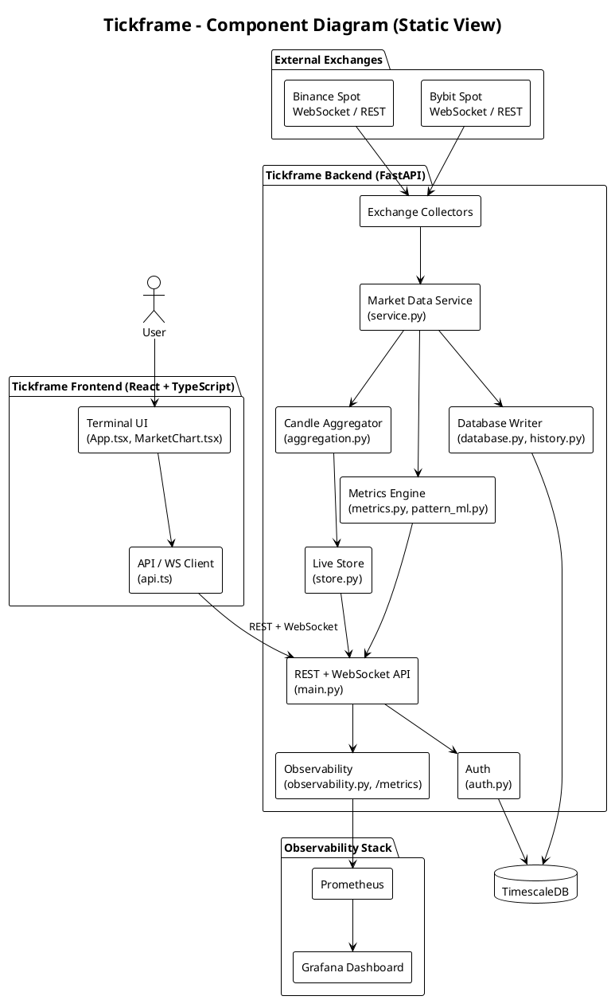
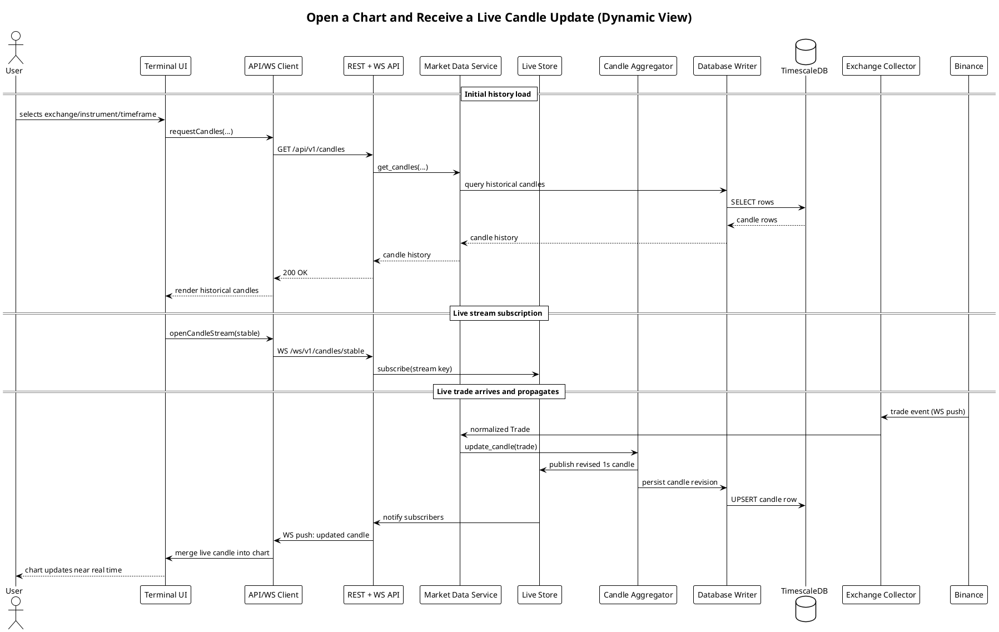
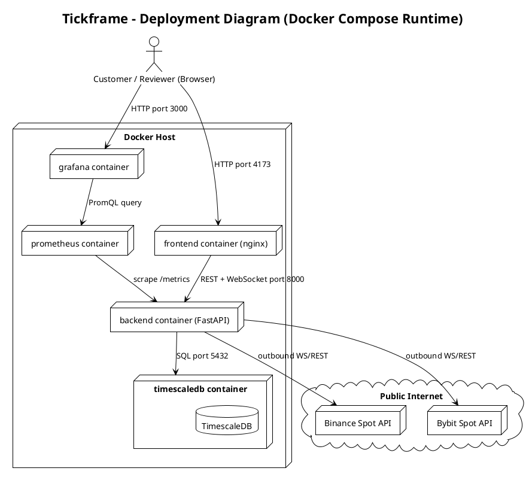

# Tickframe Architecture

This page is the maintained architecture landing page for Tickframe. It links
the current architecture decisions to the product structure, quality
requirements, and Sprint 3 / Assignment 5 documentation.

## Current Architecture

Tickframe is a real-time crypto market analytics product. The product keeps
Binance and Bybit as independent market data sources, normalizes public Spot
trades, builds reproducible candles, stores history in TimescaleDB, and exposes
market data to a React terminal through REST and WebSocket APIs.

The main runtime flow is:

1. Exchange collectors in [`backend/app/service.py`](../../backend/app/service.py)
   and [`backend/app/exchanges/`](../../backend/app/exchanges/) subscribe to
   public Binance and Bybit Spot streams.
2. Exchange-specific messages are normalized into canonical trades using the
   configured market and instrument map in
   [`backend/config/markets.yaml`](../../backend/config/markets.yaml).
3. [`backend/app/aggregation.py`](../../backend/app/aggregation.py) converts
   trades into delayed, revision-aware `1s` OHLCV candles.
4. [`backend/app/database.py`](../../backend/app/database.py) persists raw
   trades, candle revisions, rollups, metric points, metric events, and latest
   metric summaries in TimescaleDB.
5. [`backend/app/main.py`](../../backend/app/main.py) exposes REST endpoints
   for initial reads and WebSocket endpoints for market, candle, and metric
   updates.
6. [`frontend/src/api.ts`](../../frontend/src/api.ts) and
   [`frontend/src/components/MarketChart.tsx`](../../frontend/src/components/MarketChart.tsx)
   render the terminal view with exchange, instrument, timeframe, chart,
   metric, and telemetry flows.
7. [`docker-compose.yml`](../../docker-compose.yml) runs the local product
   stack with backend, frontend, TimescaleDB, Prometheus, and Grafana.

## Architecture Views

| View | Diagram | Source |
|---|---|---|
| Static view | Component diagram | [`static-view/component-diagram.puml`](static-view/component-diagram.puml) |
| Dynamic view | Sequence diagram — open a chart and receive a live candle update | [`dynamic-view/chart-open-and-live-update-sequence.puml`](dynamic-view/chart-open-and-live-update-sequence.puml) |
| Deployment view | Deployment diagram | [`deployment-view/deployment-diagram.puml`](deployment-view/deployment-diagram.puml) |

All three diagrams are PlantUML sources. They can be rendered locally with
`plantuml docs/architecture/**/*.puml` or with any PlantUML-compatible viewer
(VS Code PlantUML extension, IntelliJ plugin, or the PlantUML server). Rendered
PNG/SVG output is intentionally not committed so the diagram source remains the
single source of truth and stays trivial to diff in review.

---

## Static View

### Component Diagram

```
docs/architecture/static-view/component-diagram.puml
```

<details>
<summary>View PlantUML source</summary>



The full annotated source (with notes on revision handling and retention) is
in [`static-view/component-diagram.puml`](static-view/component-diagram.puml).

</details>

### What the Diagram Shows

The component diagram shows Tickframe as three layers around a shared data
store:

- **External systems**: Binance and Bybit public Spot WebSocket/REST endpoints
  are shown as separate, independent sources (never merged), consistent with
  [ADR-001](adr/ADR-001-independent-exchange-sources.md).
- **Frontend**: the terminal UI and its API/WS client, which talk to the
  backend exclusively through REST for initial loads and WebSocket for live
  updates.
- **Backend**: exchange collectors, the candle aggregator, an in-memory live
  store, the metrics engine, the REST/WebSocket API layer, an auth module, a
  database writer, and an observability module.
- **Infrastructure**: TimescaleDB as the persistent store, and Prometheus plus
  Grafana as the observability stack that scrapes and visualizes backend
  metrics.

Arrows show the main relations: trades flow from exchanges through collectors
into the aggregator and metrics engine, the database writer persists
everything relevant to TimescaleDB, and the API layer exposes both the live
store (fast, in-memory) and the database (durable, historical) to the
frontend. Protocol labels (WebSocket, REST, SQL, PromQL) mark the important
interfaces between components.

### Coupling and Cohesion

- **Cohesion is high inside modules**: `aggregation.py` only knows about
  candle construction and revision rules, `database.py`/`history.py` only
  know about persistence and time-range queries, `metrics.py` only computes
  indicators, and `exchanges/*.py` only know how to talk to one exchange's
  wire format. Each module has a single, well-named responsibility.
- **Coupling to a shared in-process pipeline is intentional but real**:
  `service.py` (the `MarketDataService`) coordinates collectors, the
  aggregator, the live store, the metrics engine, and the database writer.
  This creates a central coordination point; it is necessary because trades
  must reach the aggregator, the metrics engine, and storage in a consistent
  order, but it also means `service.py` is the module most sensitive to
  change across the whole backend.
- **Coupling to exchanges is isolated** behind the `ExchangeCollector` base
  class (`exchanges/base.py`), so `binance.py` and `bybit.py` can change
  independently and a new exchange can be added without touching the
  aggregator, metrics engine, or API layer.
- **Frontend and backend are loosely coupled** through documented REST/
  WebSocket contracts (`api.ts` on one side, `main.py` on the other); neither
  imports the other's code, only its network contract.

### Maintainability Implications

- Because exchange-specific logic is isolated, adding a third exchange mainly
  touches `exchanges/`, `config.py`, and `markets.yaml`, not the aggregation,
  metrics, or API layers — this keeps the blast radius of that kind of change
  small.
- Because `service.py` fans out to several downstream components, changes to
  the trade-processing pipeline (e.g., adding a new derived series) tend to
  require a coordinated change across `service.py`, `aggregation.py`, and
  `database.py`. Tests for these modules are treated as critical-path tests
  (see [ADR-002](adr/ADR-002-timescaledb-time-series-storage.md) and
  [QR-003](../quality-requirements.md#qr-003-critical-module-test-coverage)) to
  keep this coordination safe to change.
- Separating the in-memory `LiveStore` from the durable database means the
  live path can be reasoned about and tested without needing a running
  database, which keeps unit tests fast, while database-integration tests
  remain isolated to `database.py`/`history.py`.

### Quality Requirements Supported or Constrained

- The **independent-exchange, per-module collector** structure directly
  supports [QR-002 (Exchange data failure visibility)](../quality-requirements.md#qr-002-exchange-data-failure-visibility):
  a failure in one collector cannot silently corrupt the other exchange's
  data path.
- The **separate live store vs. database** structure supports
  [QR-001 (Market data update latency)](../quality-requirements.md#qr-001-market-data-update-latency):
  live reads do not have to wait on database round-trips.
- The **central `MarketDataService` coordination point** constrains how
  independently the aggregation and persistence logic can evolve; the
  structure was chosen for ordering/consistency guarantees over the maximum
  possible module independence, which is a deliberate tradeoff documented in
  [ADR-002](adr/ADR-002-timescaledb-time-series-storage.md) and
  [ADR-003](adr/ADR-003-websocket-driven-market-updates.md).

---

## Dynamic View

### Sequence Diagram

```
docs/architecture/dynamic-view/chart-open-and-live-update-sequence.puml
```

<details>
<summary>View PlantUML source</summary>



The full annotated source is in
[`dynamic-view/chart-open-and-live-update-sequence.puml`](dynamic-view/chart-open-and-live-update-sequence.puml).

</details>

### Scenario

The diagram shows a user opening a chart for a given exchange, instrument, and
timeframe, then receiving a live candle update after a new trade arrives on
that exchange. It combines the two halves of a normal terminal session: (1) an
initial REST-based history load, and (2) a WebSocket-driven live update that
starts at the exchange and ends at the user's screen.

### Why This Scenario Is Important

This is the core, non-trivial workflow of the product: everything else in
Tickframe (metrics, alerts, patterns) is built on top of a user reliably
seeing current, correctly revised candles for the exchange and instrument they
selected. It is also the workflow most exposed to real-world failure modes —
network hiccups, late trades, exchange-specific outages — so it is the
scenario most worth documenting precisely.

### Architecture Decisions, Integration Boundaries, and Quality Requirements It Helps Reason About

- It shows the **REST-for-history / WebSocket-for-live** split from
  [ADR-003](adr/ADR-003-websocket-driven-market-updates.md), including why the
  frontend needs to merge two data paths rather than relying on one.
- It shows the **exchange → collector → aggregator** boundary from
  [ADR-001](adr/ADR-001-independent-exchange-sources.md): a trade is only
  normalized after it leaves the exchange-specific collector, so exchange
  quirks never leak into the aggregator or API layer.
- It shows the **write-through-and-notify pattern** (aggregator writes to both
  the live store and the database) that underpins
  [ADR-002](adr/ADR-002-timescaledb-time-series-storage.md): the live store
  gives low-latency delivery to connected clients, while TimescaleDB keeps a
  durable, replayable history.
- It is the primary path evaluated by
  [QR-001 (Market data update latency)](../quality-requirements.md#qr-001-market-data-update-latency):
  the diagram identifies every hop a trade must cross before a user sees it,
  which is exactly what the 1-second latency budget in QR-001 has to cover.

### What the Diagram Shows

The diagram is split into three fragments. The first (`Initial history load`)
shows a synchronous REST call that returns already-persisted candle history
from TimescaleDB. The second (`Live stream subscription`) shows the frontend
opening a WebSocket and the backend registering that connection against a
stream key (exchange + instrument + timeframe). The third (`Live trade
arrives and propagates`) shows an asynchronous, event-driven path: a trade
pushed by Binance travels through the collector, the market data service, and
the aggregator, is persisted to TimescaleDB, and is simultaneously pushed to
the already-open WebSocket connection so the chart updates without the user
taking any further action.

---

## Deployment View

### Deployment Diagram

```
docs/architecture/deployment-view/deployment-diagram.puml
```

<details>
<summary>View PlantUML source</summary>



The full annotated source (with volumes, health checks, and dependency
ordering) is in
[`deployment-view/deployment-diagram.puml`](deployment-view/deployment-diagram.puml).

</details>

### What the Diagram Shows

The deployment diagram maps directly onto [`docker-compose.yml`](../../docker-compose.yml).
It shows:

- **Deployed services**: `frontend` (nginx serving the built React app),
  `backend` (the FastAPI app, collectors, aggregator, and API), `timescaledb`,
  `prometheus`, and `grafana`, each in its own container on one Docker host.
- **Datastores/stateful infrastructure**: the `timescaledb` container with its
  named volume `tickframe-timescale-data`, plus the `prometheus` and `grafana`
  containers' own named volumes for metric and dashboard state.
- **External services**: Binance and Bybit public APIs, reached by outbound
  connections from the backend container only.
- **Network/environment boundaries**: all five containers share a Compose
  network; only `frontend` (port 4173→80), `backend` (port 8000), `prometheus`
  (port 9090), and `grafana` (port 3000) are published to the host, and
  `timescaledb`'s port 5432 stays internal to the Compose network.
- **Customer-facing access path**: a browser reaches the product only through
  the `frontend` container, which in turn talks to the `backend` container;
  `grafana` is a separate, secondary access path for observability review.

### Why the Selected Deployment Model Was Chosen

Docker Compose was chosen because Tickframe needs five coordinated processes
(API/collector service, frontend, database, and two observability services)
to be reproducible for local development, grading/review, and small-scale
operation without needing a container orchestrator. `docker-compose.yml`
encodes explicit `depends_on` health-check ordering (backend waits for
TimescaleDB to be healthy, frontend waits for backend to be healthy,
Prometheus waits for backend, Grafana waits for Prometheus) so a single
`docker compose up --build` produces a working stack deterministically. This
decision is recorded in
[ADR-004](adr/ADR-004-dockerized-local-deployment-and-observability.md).

### How the Current Deployment Supports or Constrains the Product

- **Supports** reproducible review: anyone with Docker can bring up the full
  product, including working observability, with one command and a `.env`
  file.
- **Supports** operational visibility: Prometheus and Grafana are part of the
  default stack, not an optional add-on, so latency and failure signals
  required by [QR-001](../quality-requirements.md#qr-001-market-data-update-latency)
  and [QR-002](../quality-requirements.md#qr-002-exchange-data-failure-visibility)
  are available out of the box.
- **Constrains** horizontal scaling: each service currently runs as a single
  container with no replication or load balancing, so the deployment model as
  it stands is intended for local/small-scale use, not high-availability
  production traffic.
- **Constrains** secrets handling: credentials (`POSTGRES_PASSWORD`, Grafana
  admin credentials) are supplied through a local `.env` file rather than a
  managed secrets store, which is acceptable for the current scope but would
  need to change before a public production deployment.

### What Must Be Considered When Deploying or Operating It for the Customer

- A `.env` file with a real `POSTGRES_PASSWORD` (and optionally
  `GRAFANA_ADMIN_PASSWORD`, exchange URL overrides, and backfill/repair
  tuning) must be created before `docker compose up --build`, per the root
  [`README.md`](../../README.md).
- Only `frontend`'s port needs to be exposed to end customers; `backend`,
  `prometheus`, and `grafana` ports are useful for reviewers/operators but are
  not required for a customer-only deployment and can be restricted at the
  network boundary.
- TimescaleDB's volume (`tickframe-timescale-data`) is the durable state of
  the product; operators must back it up or otherwise protect it, since
  losing it loses trade/candle/metric history subject to the retention
  policy in [ADR-002](adr/ADR-002-timescaledb-time-series-storage.md).
- Outbound connectivity to Binance and Bybit public endpoints is required for
  the backend container; operators should confirm this connectivity (and any
  required fallback URLs, per [ADR-001](adr/ADR-001-independent-exchange-sources.md))
  before relying on the deployment for live data.

---

## Decision Map

| Architecture concern | Decision record | Quality requirements |
|---|---|---|
| Keep exchange data inspectable and avoid synthetic blended prices. | [ADR-001: Independent exchange sources](adr/ADR-001-independent-exchange-sources.md) | [QR-001](../quality-requirements.md#qr-001-market-data-update-latency), [QR-002](../quality-requirements.md#qr-002-exchange-data-failure-visibility) |
| Store market history as time-series data with bounded retention and rollups. | [ADR-002: TimescaleDB time-series storage](adr/ADR-002-timescaledb-time-series-storage.md) | [QR-001](../quality-requirements.md#qr-001-market-data-update-latency), [QR-003](../quality-requirements.md#qr-003-critical-module-test-coverage) |
| Use WebSockets for live market, candle, and metrics updates while keeping REST for initial loads. | [ADR-003: WebSocket-driven market updates](adr/ADR-003-websocket-driven-market-updates.md) | [QR-001](../quality-requirements.md#qr-001-market-data-update-latency), [QR-002](../quality-requirements.md#qr-002-exchange-data-failure-visibility) |
| Keep the complete product runnable through Docker Compose with observable services. | [ADR-004: Dockerized local deployment and observability](adr/ADR-004-dockerized-local-deployment-and-observability.md) | [QR-001](../quality-requirements.md#qr-001-market-data-update-latency), [QR-002](../quality-requirements.md#qr-002-exchange-data-failure-visibility), [QR-003](../quality-requirements.md#qr-003-critical-module-test-coverage) |

## Related Maintained Documents

- [Root README](../../README.md) for product scope, local run guidance, and
  deployment notes.
- [Development process](../development-process.md) for branch, PR, CI, and
  configuration-management workflow.
- [Quality requirements](../quality-requirements.md) and
  [quality requirement tests](../quality-requirement-tests.md) for ISO/IEC
  25010 traceability.
- [Testing status](../testing.md) for current automated tests, CI gates, and
  coverage evidence.
- [Definition of Done](../definition-of-done.md) for the delivery gates that
  apply to later MVP v2 work.
2 work.
