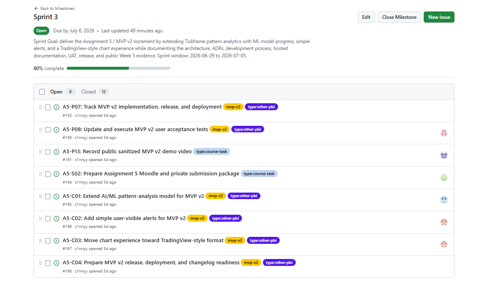
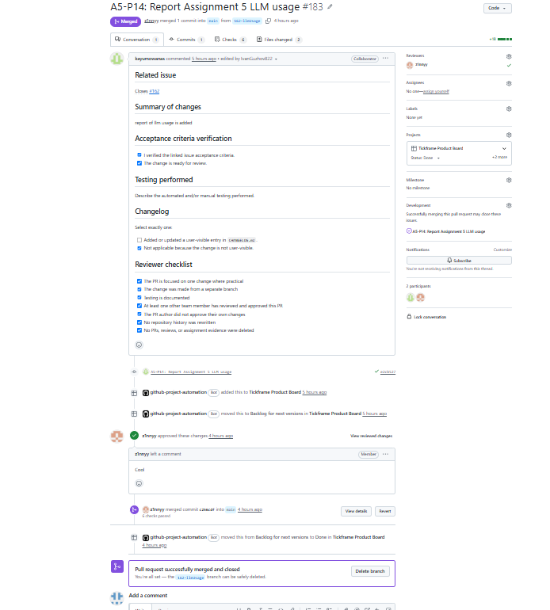

# Week 5 Report

## Project Information

| Item | Value |
|---|---|
| Project Name | TickFrame |
| Sprint | Sprint 3 |
| MVP Version | MVP v2 |
| Repository | <https://github.com/Team-29-TickFrame/Tickframe_team_29> |
| Sprint Goal | Deliver MVP v2 by improving maintainability, documenting architecture, introducing ADRs, and extending quality assurance documentation. |

## Planning and Tracking

| Artifact | Link |
|---|---|
| Product Backlog | INSERT_BACKLOG_LINK |
| Sprint Backlog Board | INSERT_PROJECT_LINK |
| Sprint 3 Milestone | INSERT_MILESTONE_LINK |
| Issues | <https://github.com/Team-29-TickFrame/Tickframe_team_29/issues> |
| Pull Requests | <https://github.com/Team-29-TickFrame/Tickframe_team_29/pulls> |

## Maintained Project Assets

| Asset | Link |
|---|---|
| Hosted documentation site | <https://team-29-tickframe.github.io/Tickframe_team_29/> |
| Roadmap | [`docs/roadmap.md`](../../docs/roadmap.md) |
| Development process and configuration management | [`docs/development-process.md`](../../docs/development-process.md) |
| Architecture documentation and ADRs | [`docs/architecture/README.md`](../../docs/architecture/README.md) |
| Testing and quality evidence | [`docs/testing.md`](../../docs/testing.md) |
| Quality requirements | [`docs/quality-requirements.md`](../../docs/quality-requirements.md) |
| Quality requirement tests | [`docs/quality-requirement-tests.md`](../../docs/quality-requirement-tests.md) |
| User acceptance tests | [`docs/user-acceptance-tests.md`](../../docs/user-acceptance-tests.md) |
| Week 5 customer feedback response | [`customer-feedback-response.md`](./customer-feedback-response.md) |
| Week 5 LLM usage report | [`llm-report.md`](./llm-report.md) |
| Week 5 reflection | [`reflection.md`](./reflection.md) |
| Week 5 retrospective | [`retrospective.md`](./retrospective.md) |
| Week 5 Sprint Review Summary | [`sprint-review-summary.md`](./sprint-review-summary.md) |

## MVP v2 Delivered Changes

- Added architecture documentation with static, dynamic, and deployment views.
- Introduced Architecture Decision Records (ADRs).
- Improved development process documentation.
- Extended quality requirement traceability.
- Continued development of analytics and pattern-detection functionality.
- Maintained CI/CD and testing workflows.

## Product Access

| Artifact | Link |
|---|---|
| Product Access | INSERT_DEPLOYMENT_LINK |
| Run Instructions | [`README.md`](../../README.md) |

## Customer Feedback Response

| Feedback Point | Resulting Issue | Status | Response |
|---|---|---|---|
| Pattern visualization should be clearer | INSERT_ISSUE | Planned | Additional visualization improvements remain in the backlog. |
| More robust handling of unavailable market data | INSERT_ISSUE | In Progress | Error handling and system documentation were improved. |
| Improve pattern validation with real datasets | INSERT_ISSUE | Planned | Included in future backlog refinement. |

## Architecture

| Artifact | Link |
|---|---|
| Architecture Overview | [`docs/architecture/README.md`](../../docs/architecture/README.md) |
| Static View | [`docs/architecture/static-view`](../../docs/architecture/static-view/) |
| Dynamic View | [`docs/architecture/dynamic-view`](../../docs/architecture/dynamic-view/) |
| Deployment View | [`docs/architecture/deployment-view`](../../docs/architecture/deployment-view/) |
| ADR Directory | [`docs/architecture/adr`](../../docs/architecture/adr/) |

### Architecture Summary

TickFrame uses a modular architecture consisting of a frontend application, backend API, analytics modules, external market data providers, and persistent storage.

The architecture separates market data collection, analytics processing, and user-facing functionality to improve maintainability, scalability, and testability.

## Testing and CI

| Artifact | Link |
|---|---|
| GitHub Actions | <https://github.com/Team-29-TickFrame/Tickframe_team_29/actions> |
| Latest Protected Branch CI Run | INSERT_CI_RUN_LINK |

### Testing Summary

- Authentication functionality
- Market data aggregation
- Analytics calculations
- Pattern detection pipeline
- API endpoints
- Frontend integration

## Release Information

| Artifact | Link |
|---|---|
| MVP v2 Release | INSERT_RELEASE_LINK |
| CHANGELOG | [`CHANGELOG.md`](../../CHANGELOG.md) |

## User Acceptance Testing

Customer-executed UAT was not completed during Sprint 3 because the planned Sprint Review and customer validation session were postponed.

Existing UAT scenarios remain available and will be executed during the next customer review session.

## Sprint Review

The planned Sprint Review with the customer was postponed because the MVP v2 increment was not fully ready for customer demonstration.

No new customer feedback was collected during this Sprint.

| Artifact | Link |
|---|---|
| Sprint Review Summary | [`sprint-review-summary.md`](./sprint-review-summary.md) |

## Hosted Documentation Notes

The hosted documentation site is deployed from the repository's maintained documentation through the `Documentation Site` GitHub Actions workflow.

After the MVP v2 SemVer release is created, add the same hosted documentation URL to the release notes where practical.

## Demo Video

| Artifact | Link |
|---|---|
| Public Sanitized MVP v2 Demo | INSERT_VIDEO_LINK |

## Current Product Status

### Implemented Functionality

- Live market data aggregation
- Technical indicators
- Analytics pipeline
- Pattern detection foundation
- Architecture documentation
- ADR traceability

### Planned Functionality

- Improved pattern visualization
- Extended analytics capabilities
- Additional customer-requested enhancements

## Next Steps

- Complete remaining MVP v2 functionality.
- Conduct postponed customer review.
- Execute customer UAT.
- Collect additional customer feedback.
- Refine backlog for the next Sprint.

## Contribution Traceability

| Team Member | Contributions |
|---|---|
| Diana | Architecture documentation, ADRs, reports, Sprint documentation |
| Team Member 2 | Backend implementation |
| Team Member 3 | Frontend implementation |
| Team Member 4 | Analytics and pattern detection |
| Team Member 5 | Testing and CI support |

## Evidence Screenshots

### Sprint Milestone

### Sprint Board

### Latest CI Run

### MVP v2 Release

### Reviewed Pull Request

### Hosted Documentation

### Product Access Artifact

